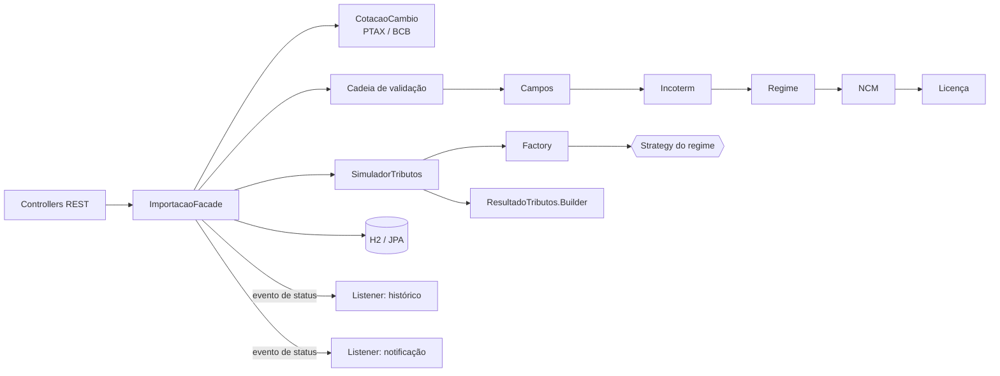
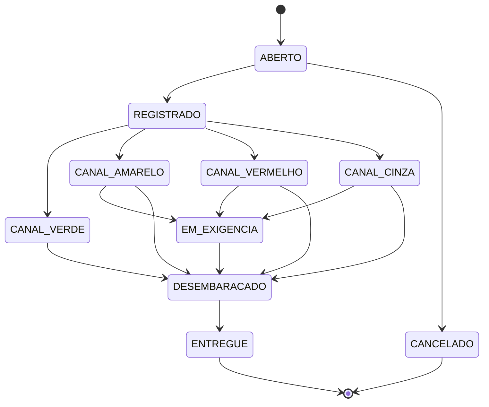

# Comex Patterns API

API REST em **Spring Boot 3 / Java 21** que simula os tributos de uma importação brasileira e acompanha o processo até a entrega, aplicando **Padrões de Projeto (GoF)** em um problema real de comércio exterior.

Projeto final do desafio **"Explorando Padrões de Projetos na Prática com Java"** da [DIO](https://www.dio.me/). Parte da ideia do [lab de referência com Spring](https://github.com/digitalinnovationone/lab-padroes-projeto-spring) (Singleton, Strategy e Facade consumindo o ViaCEP) e leva esses padrões para outro domínio, somando outros padrões.

[](https://github.com/lucasgarciarodrigues2011-lgtm/comex-patterns-api/actions/workflows/ci.yml)

## O que a API faz

- **Simula tributos de importação** (II, IPI, PIS, COFINS e ICMS "por dentro") a partir do valor da mercadoria, frete, seguro, Incoterm e NCM.
- Aplica regras de **quatro regimes aduaneiros**: importação comum, Admissão Temporária com suspensão total (ex.: feiras), Admissão Temporária para utilização econômica (1% ao mês) e Drawback suspensão.
- **Valida a operação** antes de calcular: coerência entre Incoterm, frete e seguro, NCM cadastrada, necessidade de licença (LI/LPCO) e regras do regime — devolvendo **todas** as pendências de uma vez.
- Busca a **taxa de câmbio PTAX** na API pública do Banco Central quando ela não é informada.
- Abre **processos de importação** e controla o ciclo de vida (registro da DUIMP → canal de parametrização → desembaraço → entrega), com histórico de auditoria e notificação ao cliente.

## Padrões de projeto aplicados

| Padrão | Onde | Por quê |
|---|---|---|
| **Strategy** | `core/fiscal/CalculoTributarioStrategy` + `estrategias/*` | Cada regime aduaneiro decide quanto de cada tributo é devido. Novo regime = nova classe, sem mexer no simulador. |
| **Factory** | `core/fiscal/EstrategiaTributariaFactory` | Entrega a estratégia do regime sem `if/switch`; o Spring injeta todas as estratégias como lista. |
| **Chain of Responsibility** | `core/validacao/ValidadorImportacao` + `validadores/*` | Cada elo verifica uma regra (campos, Incoterm, regime, NCM, licença). Acumula erros e pode interromper a cadeia quando os próximos elos dependem dele. |
| **Builder** | `core/model/ResultadoTributos.Builder` | Monta um resultado imutável com muitos campos e totais derivados. |
| **Singleton** | `core/fiscal/ParametrosFiscais` (enum) e beans do Spring | Duas formas: o *enum singleton* do Java puro (Effective Java) e o escopo singleton padrão dos beans do Spring (`config/PadroesConfig`). |
| **Facade** | `service/ImportacaoFacade` | Um ponto de entrada que orquestra câmbio, validação, cálculo, persistência e eventos. Os controllers só falam com ela. |
| **Observer** | `evento/*` (eventos do Spring) | Mudanças de status publicam um evento; um listener grava o histórico e outro notifica o cliente. Quem publica não conhece quem escuta. |
| **Adapter** | `infra/persistence/NcmCatalogoJpaAdapter`, `infra/cambio/PtaxCotacaoCambioAdapter` | Ligam as portas do domínio (`CatalogoNcm`, `CotacaoCambio`) ao JPA e à API do Banco Central. |
| **State** (via enum) | `core/model/StatusProcesso` | Cada status conhece suas transições válidas; saltos inválidos (ex.: `ABERTO → DESEMBARACADO`) são bloqueados. |
| **Repository** | `infra/persistence/*Repository` | Acesso a dados com Spring Data JPA, como no lab de referência. |

## Arquitetura

O pacote `core` é **Java puro**, sem nenhuma dependência de framework — dá para testar toda a regra de negócio sem subir o Spring. As camadas de fora (`infra`, `service`, `api`) adaptam o núcleo ao Spring.



```
src/main/java/br/com/comex/patterns
├── core/                 # Java puro: regras de negócio e padrões
│   ├── model/            # Regime, Incoterm, StatusProcesso (State), ResultadoTributos (Builder)...
│   ├── fiscal/           # Strategy, Factory, Singleton e o SimuladorTributos
│   ├── validacao/        # Chain of Responsibility
│   └── port/             # Interfaces que o núcleo precisa (CatalogoNcm, CotacaoCambio)
├── infra/                # Adapters: JPA e API PTAX do Banco Central
├── evento/               # Observer: evento e listeners
├── service/              # Facade
├── config/               # Registro dos beans (singletons do Spring)
└── api/                  # Controllers, DTOs e tratamento de erros (Problem Details)
```

## Como executar

Pré-requisitos: **Java 21** e **Maven 3.9+** (ou abra o projeto no IntelliJ / VS Code, que já trazem o Maven).

```bash
mvn spring-boot:run      # sobe a API em http://localhost:8080
mvn test                 # roda os testes unitários e de integração
```

- Swagger UI: http://localhost:8080/swagger-ui.html
- Console do H2: http://localhost:8080/h2-console (JDBC URL `jdbc:h2:mem:comex`, usuário `sa`, sem senha)

## Exemplos de uso

**Simular uma importação comum** (US$ 10.000 FOB + US$ 1.000 de frete + US$ 100 de seguro, câmbio 5,00, ICMS 18%):

```bash
curl -X POST http://localhost:8080/api/simulacoes -H "Content-Type: application/json" -d '{
  "ncm": "8474.20.10", "incoterm": "FOB", "moeda": "USD", "taxaCambio": 5.00,
  "valorMercadoria": 10000, "frete": 1000, "seguro": 100,
  "despesasAduaneiras": 500, "aliquotaIcms": 18, "regime": "COMUM"
}'
```

Resultado resumido:

| Item | Valor (R$) |
|---|---|
| Valor aduaneiro | 55.500,00 |
| II (14%) | 7.770,00 |
| IPI (10%) | 6.327,00 |
| PIS (2,10%) | 1.165,50 |
| COFINS (9,65%) | 5.355,75 |
| ICMS (18%, por dentro) | 16.818,64 |
| **Total de tributos** | **37.436,89** |

Troque `"regime"` para `"ADMISSAO_TEMPORARIA_SUSPENSAO_TOTAL"` (com `"mesesPermanencia": 6`) e o total devido vira zero, com os R$ 37.436,89 aparecendo como **suspensos** — a base da garantia do termo de responsabilidade. Omita `taxaCambio` para usar a PTAX do dia.

**Abrir um processo e acompanhar o status:**

```bash
curl -X POST http://localhost:8080/api/processos -H "Content-Type: application/json" -d '{
  "referencia": "IMP-2026-0001", "importador": "Mineradora Exemplo Ltda",
  "importacao": { "ncm": "84742010", "incoterm": "FOB", "moeda": "USD", "taxaCambio": 5.00,
    "valorMercadoria": 10000, "frete": 1000, "seguro": 100, "despesasAduaneiras": 500,
    "aliquotaIcms": 18, "regime": "COMUM" }
}'

curl -X PATCH http://localhost:8080/api/processos/1/status -H "Content-Type: application/json" \
     -d '{"status": "REGISTRADO", "observacao": "DUIMP registrada"}'

curl http://localhost:8080/api/processos/1/historico
```

Uma validação que falha retorna `422` com todos os problemas encontrados:

```json
{
  "title": "Importação inválida",
  "status": 422,
  "erros": [
    "Incoterm CIF já inclui o frete internacional no valor da mercadoria; informe frete = 0.",
    "Incoterm CIF já inclui o seguro no valor da mercadoria; informe seguro = 0."
  ]
}
```

## Endpoints

| Método | Rota | Descrição |
|---|---|---|
| `POST` | `/api/simulacoes` | Simula os tributos sem gravar |
| `POST` | `/api/processos` | Valida, calcula e abre um processo (`ABERTO`) |
| `GET` | `/api/processos?status=` | Lista processos (filtro opcional por status) |
| `GET` | `/api/processos/{id}` | Detalha um processo, incluindo os próximos status permitidos |
| `PATCH` | `/api/processos/{id}/status` | Avança o status (dispara os observers) |
| `GET` | `/api/processos/{id}/historico` | Trilha de auditoria |
| `GET` | `/api/ncms` | Catálogo de NCMs de exemplo |

## Fluxo de status



## Tecnologias

Java 21 (records, switch expressions, text blocks) · Spring Boot 3.5 (Web, Data JPA, Validation) · `RestClient` · H2 · springdoc-openapi (Swagger) · JUnit 5, AssertJ, MockMvc e Mockito · GitHub Actions.

## Evoluções em relação ao lab de referência

- Atualização de Spring Boot 2.5 / Java 11 para **Spring Boot 3.5 / Java 21**.
- Domínio real de comércio exterior no lugar do cadastro de clientes.
- De 3 para **10 padrões** aplicados, cada um com um motivo de existir no código.
- Núcleo de regras em **Java puro**, independente de framework.
- Integração externa com a **PTAX do Banco Central** via `RestClient` (no lugar do ViaCEP com OpenFeign).
- Erros no padrão **Problem Details (RFC 9457)**.
- **Testes** unitários e de integração e **CI** no GitHub Actions.

## Aviso

Projeto **didático**. As alíquotas do catálogo de NCMs são ilustrativas e as fórmulas foram simplificadas (por exemplo, o tratamento do ICMS em Admissão Temporária e Drawback varia por estado, e há NCMs com PIS/COFINS diferenciados). Não use para cálculos reais sem conferir a legislação vigente.
